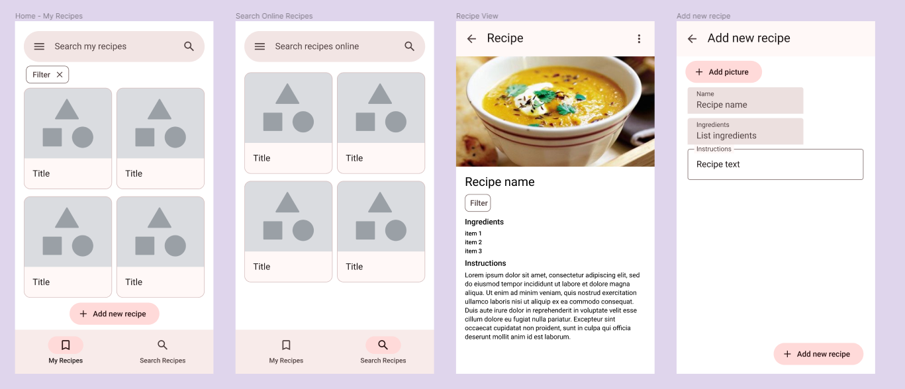
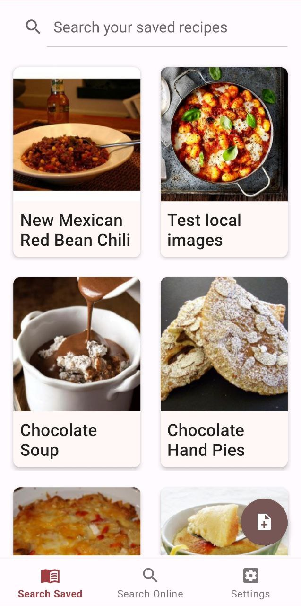
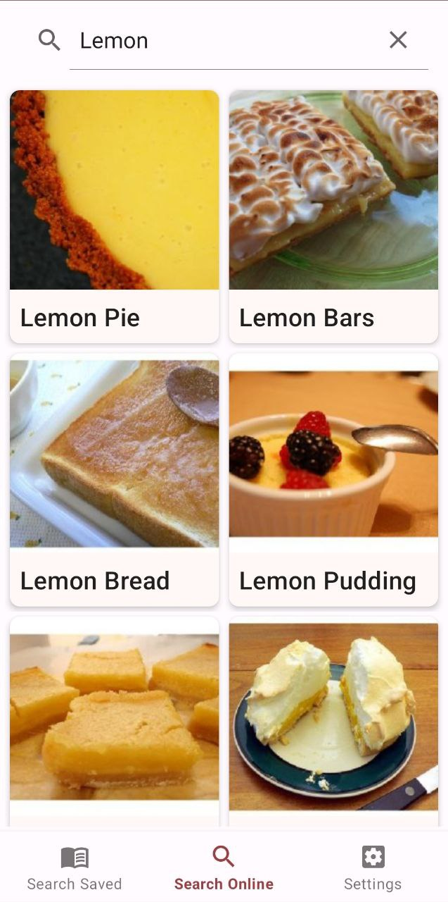
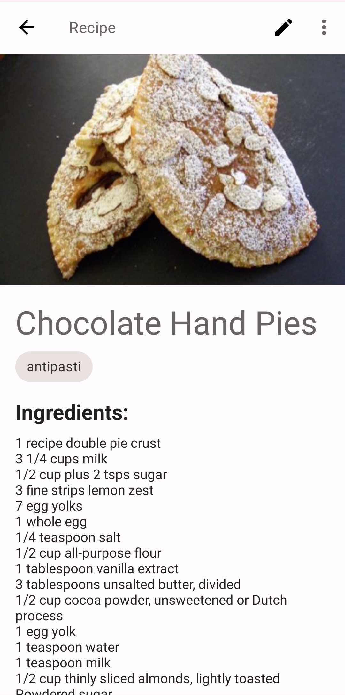
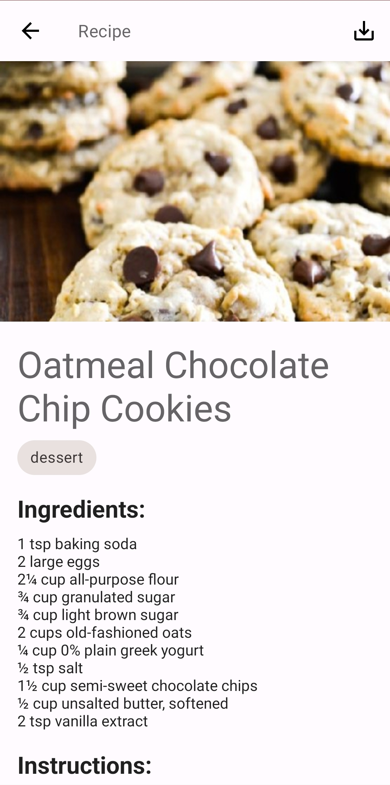
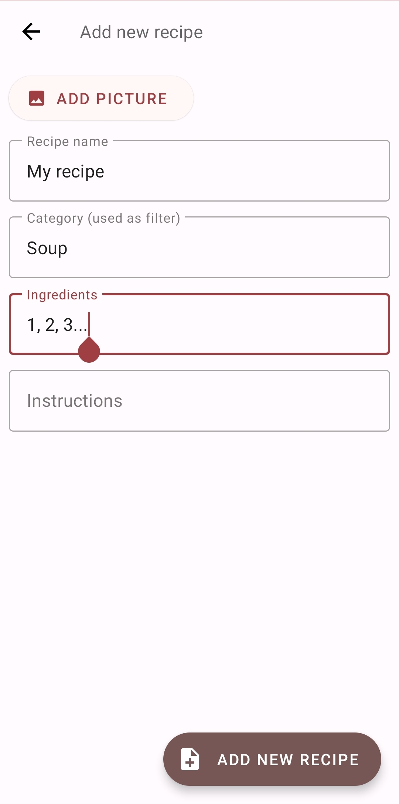
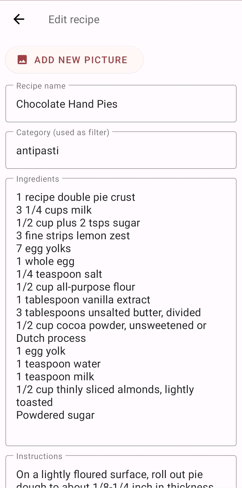
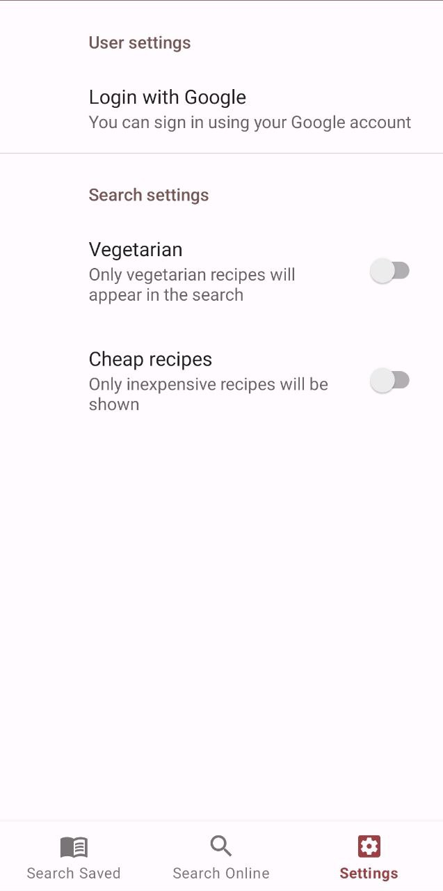

# AppRecipes
App for searching recipes online and saving them locally.

## Design made in Figma


## Setup
To use this app, you need to provide your own Spoonacular API key (https://spoonacular.com/food-api).
In `network` package, create `ApiKeys.kt` and an object with value `SPOONACULAR_API_KEY`.
To set up Google One Tap UI authentication, you should also provide an OAuth 2.0 client ID (refer to https://developers.google.com/identity/one-tap/android/get-saved-credentials).
Create an object with value `OAUTH_CLIENT_ID_FIREBASE`.
```
object ApiKeys {
  const val SPOONACULAR_API_KEY: String = *put your key here*
  const val OAUTH_CLIENT_ID_FIREBASE: String = *client ID here*
}
```
## Screenshots







